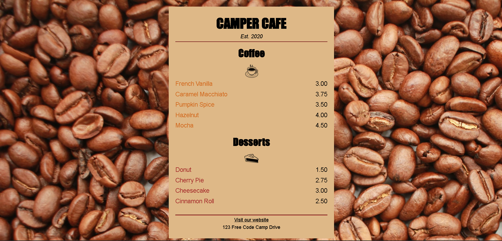

# Cafe-Menu
Project thứ 2 trong khóa học Responsive Web Design của FreeCodeCamp
Khóa học tạo ra menu của quán Cà phê
*   
## Demo trực tiếp

## Tính năng
*   Thiết kế đơn giản 
*   Giao diện đáp ứng
## Công nghệ sử dụng
*   HTML5
*   CSS3
